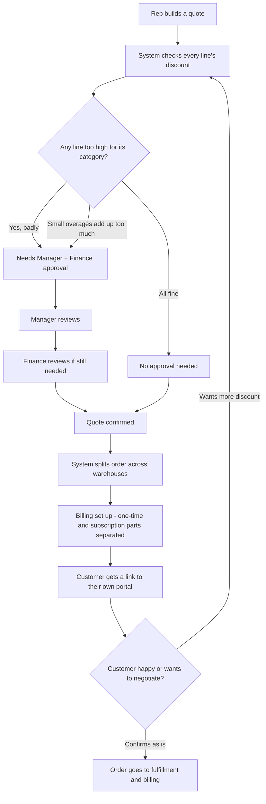

# DealFlow360 — Part 1: The Problem & Our Solution

*(Written in simple English — this is what we'll say when someone asks "what are you even building?")*

---

## 1. What's the Actual Problem?

Every company that sells things has to do this: **make a quote → get it approved → ship it → bill the customer.**

Sounds simple. It's not, because of things like:

- A salesperson gives a discount. Who checks if it's too much?
- The product is in two different warehouses. Who decides which one ships from?
- One order has a laptop (one-time buy) AND a software subscription (monthly bill). How do you bill both correctly?
- The customer wants to negotiate the price. Right now that means 10 emails back and forth.
- A deal has gone quiet for 2 weeks. Nobody notices until it's already dead.

Most simple tools stop at "make quote → confirm → invoice." They don't handle the messy real-world stuff above.

## 2. What's REALLY Going Wrong (the root cause)

Here's the simple truth: **a salesperson only sees one line at a time. Nobody sees the whole picture.**

Example:
- A salesperson gives 8% extra discount on one small item. Looks fine.
- Then 2% extra on another. Still looks fine.
- Then 3% extra on another. Still looks fine.
- Add it all up across the whole order — the company just gave away a LOT of margin, and nobody noticed because no single line looked "bad enough" to flag.

That's the actual problem hiding inside this hackathon brief. It's not "we need an approval button." It's **"how do we catch damage that's spread across many small decisions, not just one big one?"**

## 3. Who Feels This Pain?

| Person | What annoys them today |
|---|---|
| **Sales Rep** | Builds a quote, has no idea if it'll get stuck in approval until it's too late |
| **Sales Manager** | Has to manually check every single quote, even the boring ones — while risky ones slip through |
| **Finance Team** | Only finds out about risky discounts after the deal is already confirmed |
| **Customer** | Wants to negotiate but is stuck emailing back and forth |
| **Everyone** | A deal quietly goes cold and nobody realizes until it's basically dead |

Why this matters, in real numbers: studies on B2B sales (Harvard Business Review, and Forrester's 2024 buying report) show that **most deals are lost not to a competitor, but to "no decision"** — the customer just stops responding. And most B2B buyers say they weren't even happy with whoever they finally bought from. So the "deal going quiet" problem is a real, well-documented issue — not something we're making up.

## 4. What Do Existing Tools Already Do?

We looked at what real companies use today, so we know exactly what we need to beat.

| Tool | What it does | What it's missing |
|---|---|---|
| **Salesforce CPQ** (big paid tool) | Checks discount rules one by one, can look at an average discount across the order | Doesn't catch "many small discounts adding up per category" |
| **DealHub / Conga / PandaDoc** (other CPQ tools) | Simple rule: "if discount is above X%, ask for approval" | Same idea — one number vs. one limit, nothing smarter |
| **Odoo (the platform this hackathon is themed around)** | Has products, price lists, and some approval apps in its marketplace | Those approval add-ons only check ONE line at a time — no category-based logic, no adding-it-all-up logic |
| **Gong / Clari** (deal-health tools) | Tell you when a deal looks "at risk" | Cost $1,300+ per person per year, PLUS a platform fee that can be $5,000–$50,000/year. Also a totally separate tool, not part of the quote itself |

**In plain words: every tool we checked does one of two things — check ONE number against ONE limit, or cost a lot of money and live outside the actual quoting tool.** Nobody does what this hackathon is really asking for: a **smart, per-category, "add-it-all-up" discount check**, built INTO the quote itself.

## 5. Our Idea — In One Line

> **We build a "smart discount checker" that looks at every line of a quote — both individually AND all together — and only asks a human to step in when it's actually needed. And we let the customer negotiate directly in a real online page, which re-checks itself automatically.**

We're calling this the **Discount Risk Engine**. It's the one thing we polish the most, because it's the one thing the hackathon problem statement clearly cares about the most (it explains this exact idea in detail in the brief itself).

Everything else — warehouses, subscriptions, upsells, dashboards — we build too, properly, but this is our "hero feature."

## 6. Who Uses Our App?

- **Sales Rep** — builds the quote, adds products, sees discount + risk live
- **Sales Manager** — approves/rejects riskier quotes, sets up the rules
- **Finance Team** — second-level approval for the riskiest quotes, handles billing
- **Customer** — logs into their own separate portal, can negotiate, can confirm
- **Admin** — sets up products, price rules, warehouses, subscription plans

## 7. How It Works — Step by Step

**In simple words:** every time someone touches the quote — rep or customer — the system re-checks it. If it's fine, it moves forward. If it's risky, it stops and asks the right person to approve it. Nothing skips this check. That's what makes it "self-governing" — it polices itself.

## 8. Why This Will Impress Someone From R&D

- It's not just a UI with buttons — there's an actual **calculation** behind the discount check, with real logic and a formula (shown in Part 2).
- We're not inventing AI features for the sake of it — we use two small, well-known techniques (explained simply in Part 2) only where they genuinely help, and skip AI everywhere else.
- We know exactly what Odoo and other tools already do — we checked — and we can point to the exact spot where we go further.
- Everything can be tested and shown live, not just talked about.

---
**Next:** see `02-architecture-and-database.md` for how it's actually built, and `03-build-plan-and-demo.md` for who does what and how we'll demo it.
