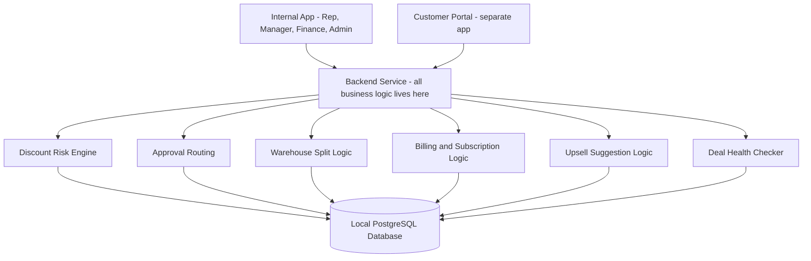
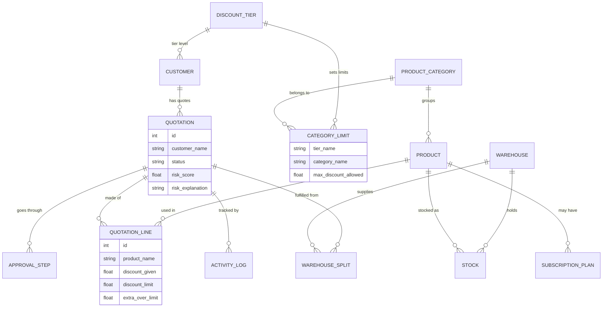
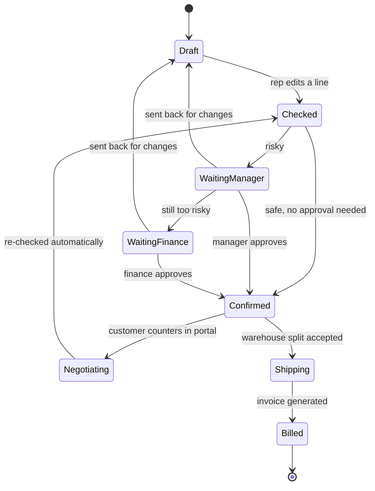
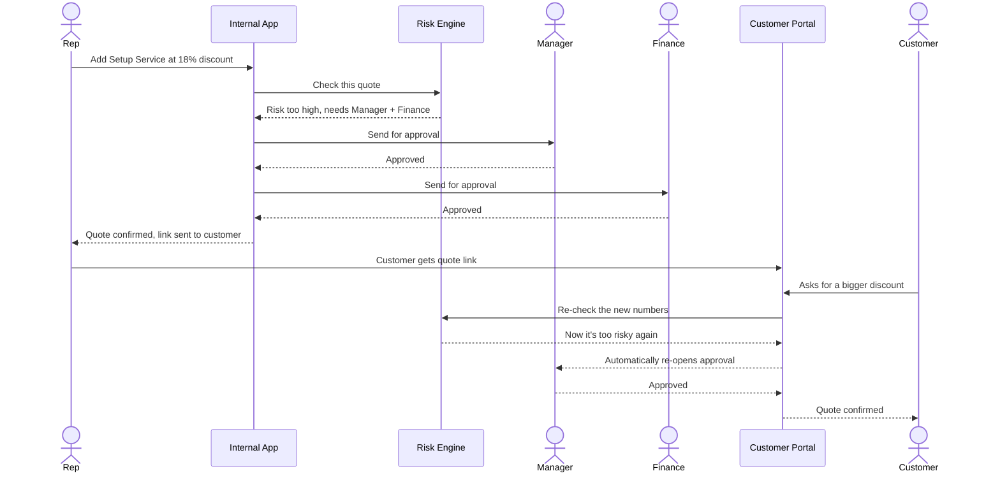

# DealFlow360 — Part 2: How It's Actually Built

*(Explains our tech choices, the database, and every diagram in plain English)*

---

## 1. Our Tech Setup (Simple Version)

- **Database: PostgreSQL, running locally** — meaning it runs on our own laptop/server, not on some cloud service. This matters for two reasons:
  1. No internet dependency during the demo — if wifi dies, our app still works.
  2. It's the honest, simple choice for a 3-person team in a short timeframe — no cloud setup headaches to debug under pressure.
- **Backend:** one shared backend service (any modern language — Python/Node, team's choice) that holds ALL the business logic — the discount checking, the warehouse splitting, the billing math. This is the important part: the brain of the app lives here, not scattered in the UI.
- **Frontend:** two separate mini-apps:
  1. **Internal app** — used by Rep, Manager, Finance, Admin.
  2. **Customer Portal** — a completely separate app with its own login, used only by the customer. This is on purpose — it proves to a judge that the "negotiation portal" is a real, restricted thing, not just an internal screen with a different color.

## 2. System Diagram — How the Pieces Talk to Each Other



**In plain words:** both apps (internal and customer portal) only talk to ONE backend. That backend has separate, clearly named modules for each job — discount checking, approvals, warehouse splitting, billing, upsells, deal health. Everything is saved to one local database. Nothing is duplicated, nothing is faked in the UI — every decision actually happens in the backend and gets saved.

## 3. The Database — What We're Actually Storing

Think of the database as a set of labeled boxes. Here's what's in each box and why:



**In plain words, box by box:**
- **CUSTOMER** — who's buying (Bronze/Silver/Gold tier).
- **DISCOUNT_TIER + CATEGORY_LIMIT** — the rules. "Gold customers can get up to 15% off Hardware, but only 10% off Services." Admin can change these anytime — they're just data, not hardcoded code.
- **QUOTATION** — the actual quote: who it's for, what stage it's at (Draft, Pending Approval, Confirmed...), and its risk score.
- **QUOTATION_LINE** — one row per product on the quote, with how much discount was given vs. allowed.
- **APPROVAL_STEP** — who approved/rejected, and when.
- **ACTIVITY_LOG** — a diary of everything that happened to a quote (for the audit trail).
- **WAREHOUSE / STOCK / WAREHOUSE_SPLIT** — which warehouse has what stock, and how an order got split between them.
- **SUBSCRIPTION_PLAN** — recurring billing details for products that need it.

## 4. The Full Life of One Quote (State by State)



**In plain words:** a quote is basically a little traffic light that keeps changing color as things happen to it. It starts as a Draft. Every time someone edits it (rep OR customer), it goes back to "Checked," gets re-scored, and either moves forward or stops for approval. This loop is what makes the system "self-governing" — nobody can skip the check, ever.

## 5. One Full Example, Start to Finish (Sequence)



**In plain words:** this is the exact demo we'll show live. A rep gives too much discount → system catches it → two people approve it → customer then asks for even more → system catches THAT too, automatically, without anyone telling it to. That last part is the moment that proves the system actually governs itself.

## 6. The Math Behind the "Smart Discount Checker" (kept simple)

For every line on the quote:
```
extra_discount = discount_given - discount_allowed_for_this_category
```
If it's positive, that line is over its limit.

Then we add up ALL the "extra" amounts across the whole quote (weighting the ones on low-margin categories a bit more, since those hurt the company more):
```
total_risk_score = sum of all extra_discount amounts (weighted)
```
- If ONE line is way, way over → auto-flag immediately, no matter what the total looks like.
- If the total score crosses a limit (even if no single line was terrible) → flag it too.
- The score decides who needs to approve it: nobody, just the Manager, or Manager + Finance.

That's it. No AI needed here — it's a formula. We keep it a formula on purpose, because an approval rule needs to be something a Finance person can actually trust and double-check, not a black box.

## 7. Where We DO Use a Little AI (only 2 small spots)

1. **Suggesting extra products (upsell)** — we look at past orders to see "people who bought X also bought Y," and suggest Y with the profit impact shown. Simple, well-known technique, nothing fancy.
2. **Spotting weird discounts / stalled deals** — we compare a rep's current discount to THEIR OWN past average. If it's way outside their normal pattern, we flag it. Same idea for deals that have gone quiet too long.

We deliberately did NOT add a chatbot, an AI agent, or anything trendy-but-useless. If it doesn't solve a real problem here, we're not adding it just to look impressive.

---
**Next:** see `03-build-plan-and-demo.md` for team roles, what we build first, folder structure, and the demo script.
