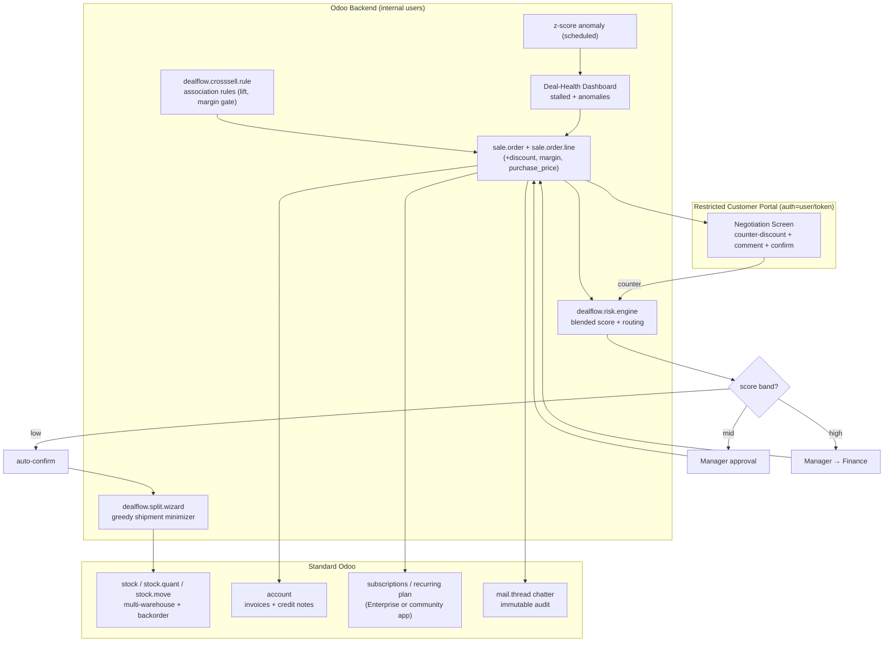

# DealFlow360 — Competitive Strategy & Deep-Research Report for the Odoo Hackathon

> **Note on the mockup:** The Excalidraw board at the provided link could not be read — the page is a client-side JavaScript app that returns no static board content when fetched, so no UI/flow signal could be extracted. All UI recommendations below are derived from the problem-statement text, not the mockup.

---

## 1. Executive Summary

**Build DealFlow360 on Odoo — decisively — but do not "build DealFlow360." Build the one thing Odoo cannot do out of the box: a genuine two-way customer negotiation loop that is governed by a real, auditable, line-aware discount-risk engine.** That is the single wedge that survives contact with ~1,000 competing teams.

The problem statement is technology-agnostic, but roughly 70–80% of its surface area maps directly onto standard Odoo modules: `sale`/`sale_management` (quotations, line and order discounts), `product`/pricelists (tiered pricing), `stock` (multi-warehouse, backorders, delivery routes), `sale_subscription` (recurring plans, proration), `account` (invoicing, credit notes), `portal`/`mail` (customer quotation view, chatter audit log), and the `margin` field on `sale.order.line`. This is both the opportunity and the trap. Using Odoo means most of the spec is configuration, shipping in hours instead of days — but judges at an Odoo hackathon will have seen the standard sales flow dozens of times, and "we configured Odoo Sales" reads as configuration, not building. Differentiation must therefore come from the ~20% Odoo does **not** do well or at all.

Our research confirms exactly where that 20% lives:

- **Odoo's native customer portal is read-mostly.** A customer can view a quotation, leave a message via the portal chatter, electronically sign, pay, and reject — but there is **no native mechanism to propose a counter-discount or line-level price change.** Any change requires the salesperson to reset the quote to draft and edit it in the backend (verified against Odoo 18/19 documentation and forum guidance).
- **Odoo's discount-approval ecosystem is single-threshold, single-line.** Dozens of Apps Store modules and the OCA module `sale_order_line_discount_validation` all implement variants of "discount > limit → Waiting Approval." **None implement a blended, per-line-limit, category-aware risk score** that aggregates distributed small violations and routes Manager-only vs. Manager-then-Finance.
- **Odoo has no native co-purchase cross-sell engine.** It offers only manually curated "optional / accessory / alternative products," with no association-rule mining and no margin gating.

**The winning concept:** a **"self-governing negotiation loop"** — a restricted customer portal screen where the customer counters a discount, the counter is scored in real time by a deterministic blended-risk engine, and the quote auto-routes to the correct approver (Manager → Finance) and back to the customer, with every step written to an immutable audit trail. AI is deliberately minimal and deterministic (association-rule cross-sell + z-score discount-anomaly detection), because a hackathon has only seed data and no credible training set. This is Odoo-native (it reuses `sale.order`, `stock`, `account`, `portal`, `mail`), demo-friendly (one screen produces the "wow"), and defensible (the blended engine + portal negotiation loop cannot be reproduced by pasting an Apps Store module).

**Verdict:** With disciplined scope this concept can plausibly land in the top few percent. Its dominant risk is over-scoping — attempting to ship all nine modules at demo quality. Build the negotiation loop + blended engine + warehouse split to full depth; treat subscriptions/dashboards as supporting cast.

---

## 2. Problem and Root-Cause Analysis

**Stated problem.** Simple sales tools handle create-quote → confirm → invoice. Real B2B sales teams face multi-level discount approvals, partial stock split across warehouses, subscriptions bundled with one-time hardware, customers who want to negotiate in a portal, and managers who learn a deal stalled only after it lost momentum. DealFlow360 asks for a "self-governing deal engine."

**Root problem.** The deeper problem is **margin leakage and deal-cycle friction caused by ungoverned human discretion.** Reps discount to close; each individual discount looks defensible; collectively they erode margin invisibly. Governance today is either a bottleneck (managers hand-approve everything) or a rubber stamp (nothing is checked). The negotiation itself happens over email, off-system, so the audit trail is fragmented and the manager has no real-time signal. The root cause is not "no approval button" — Odoo has those — it is the **absence of a line-aware, pattern-aware scoring layer that decides who must approve, tied to a governed channel where the customer's counter-offer re-enters that scoring automatically.**

**Where value leaks (INPUT → PROCESS → BOTTLENECK → FAILURE → CONSEQUENCE):**
- **INPUT:** Rep builds a quote with per-line discounts across Hardware/Services/Subscriptions.
- **PROCESS:** Rep emails a PDF; customer replies asking for more off; rep edits; maybe pings a manager on Slack.
- **BOTTLENECK:** Approval is manual and threshold-blind — either every deal waits, or none is checked; the customer counter arrives by email and is re-keyed.
- **FAILURE:** A Services line 8 points over its stricter limit slips through because the customer is "Gold"; or many small over-limits stack up unnoticed; or the deal stalls silently for two weeks.
- **CONSEQUENCE:** Eroded margin, inconsistent pricing across customers, slow cycles, no audit trail, managers reacting after momentum is lost.

**Ideal workflow (INPUT → INTELLIGENCE → DECISION → ACTION → RESULT → FEEDBACK):**
- **INPUT:** Rep builds quote; customer later counters in the portal.
- **INTELLIGENCE:** Blended risk engine scores every line against its own ceiling AND the aggregate pattern; z-score flags discounts abnormal vs the rep's own history; margin recomputes live.
- **DECISION:** Engine decides no-approval / Manager / Manager+Finance and routes automatically.
- **ACTION:** Quote moves states; approvers act; on approval, stock auto-splits across warehouses; subscription + one-time lines bill correctly.
- **RESULT:** Confirmed order, correct fulfillment and billing, one-click customer confirmation.
- **FEEDBACK:** Every event (edit, approval, counter, override) is written to the chatter/audit trail; the deal-health dashboard surfaces stalls and anomalies in real time.

---

## 3. Users, Pain Points, and Workflows

| Role | Primary job in DealFlow360 | Core frustration today | Current workaround |
|---|---|---|---|
| **Sales Rep** (primary) | Build quote, apply discounts, add upsells, respond to customer counters, track approval + fulfillment | "I don't know if this discount needs approval until I've already promised the customer"; email ping-pong | Guesses; Slack-pings manager; edits PDF; re-sends |
| **Sales Manager / Approver** (primary) | Approve/reject over-threshold quotes, configure tiers + chains, watch deal-health | Either approves everything (bottleneck) or sees nothing (blind); learns of stalls late | Spreadsheet of "deals to watch"; weekly pipeline scrub |
| **Finance / Operations** (secondary) | Second-level approval for high-risk discounts, warehouse-split/backorder calls, reconcile recurring billing + credit notes | Discovers unprofitable deals after confirmation; billing/one-time reconciliation is manual | Post-hoc margin reports; manual credit notes |
| **Customer / Portal user** (primary, external) | View quote, ask line questions, counter a discount, confirm in one click | Forced into email; no live status; static PDF | Email threads; phone calls |
| **Admin** (secondary) | Configure products, pricelists, tiers, warehouses, plans; platform analytics | Setup scattered across modules | Manual config |

The **customer** is the most under-served user in every existing Odoo build, because the native portal is read-mostly (view/comment/sign/pay/reject). That is where we concentrate.

---

## 4. Requirements and Assumptions

**Explicitly labeled ASSUMPTIONS (not in the statement):**
- **Team size 3–5; build window ~24–36 hours. [ASSUMPTION]**
- **Baseline Odoo 18/19 Community. [ASSUMPTION]** — the single most consequential assumption, because of the edition split below.
- **Seed data only; no historical dataset for ML training. [ASSUMPTION, strongly implied by "hackathon"]**

**VERIFIED edition facts (materially affect feasibility):**
- **Odoo Studio is Enterprise-only. [VERIFIED]** Confirmed by Odoo's own documentation and forum: "Odoo Studio is part of the enterprise edition and not free." Per Odoo 18/19 docs, "installing Studio in an Odoo database on the Standard pricing plan automatically triggers an upsell to the Custom pricing plan" — i.e., it is not usable on Community and forces a paid tier even on Enterprise Standard.
- **Odoo Subscriptions (`sale_subscription`) is Enterprise. [VERIFIED]** Odoo lists "Subscription Management: natively handles recurring invoicing and deferred revenue recognition" among the proprietary modules not available in Community. Community teams must use a third-party Apps Store module (e.g., `subscription_package`, "Available in Odoo 16.0 Community and Enterprise") or build recurring logic themselves.
- **Odoo 19 AI features are Enterprise-only. [VERIFIED]** "Most AI features in Odoo 19 are Enterprise-only. Community Edition users will have limited or no access to AI Agents, AI Fields in Studio, and server action automation."
- **Studio approval rules** (declarative approval conditions on buttons) are an Enterprise/Studio capability; Community teams implement approval routing in Python. **[VERIFIED via forum examples]**

**Implication:** On Community, three headline requirements (Subscriptions, Studio-based approvals, native AI) are **not** free. This actually helps our strategy: it forces custom code exactly where differentiation lives, and it means we should **not** lean on Studio approval rules or the Subscriptions app as our "moat" — every Enterprise team gets those for free.

**MoSCoW classification:**
- **Must have:** working backend+frontend with seed data; **real** (not faked) approval routing, discount governance, warehouse splitting, billing proration; a genuinely separate restricted customer portal negotiation screen; two full end-to-end flows in a 5-minute demo; one-page architecture diagram; "what's next" note.
- **Should have:** live upsell panel with margin delta; deal-health/anomaly dashboard; reporting filters + PDF/XLS export.
- **Nice to have:** multi-currency/multi-company (explicitly a bonus, not required).
- **Competitive advantage:** blended per-line risk engine; customer counter-discount → auto re-approval loop; z-score discount anomaly vs rep history; shipment-minimizing split with cost weighting.

---

## 5. Research Findings and Existing Solutions

**What standard Odoo already provides (all [VERIFIED] against Odoo docs/source):**
- **Line & order discounts:** `discount` (Disc.%) field on `sale.order.line`, enabled via Sales ▸ Settings ▸ Pricing ▸ Discounts.
- **Live margin:** `margin` and `margin_percent` fields on `sale.order.line` (from `sale_margin`), shown live as products are added; `purchase_price` holds cost.
- **Tiered pricing:** pricelists with customer-tier and currency rules.
- **Multi-warehouse & split:** setting shipping policy to "Deliver each product when available" splits deliveries by availability; delivery-route rules ("Applicable on sales order lines") can pull from a second warehouse; Odoo 18 adds one-click delivery splitting without validating prior pickings.
- **Subscriptions/proration (Enterprise):** "every mid-cycle change updates the subscription record and triggers a prorated invoice adjustment without manual intervention"; mid-cycle changes computed via `prepare_upsell_order()`; proration requires the product to be a **Service**; "Align to Period Start" aligns billing to the period start. Note a real constraint: a **Days** billing period "cannot be used as a Billing Period for subscription products" (reserved for rentals).
- **Customer portal:** `/my/orders/<id>` shows the quote, a message thread (chatter), **Sign & Pay**, and **Reject** (`/decline`).
- **Approvals:** dozens of Apps Store modules + OCA `sale_order_line_discount_validation` implement "discount > limit → Waiting Approval."
- **Audit trail:** `mail.thread`/`mail.tracking.value` chatter logs field changes with user + timestamp.

**Ten-plus existing solutions compared:**

| Solution | What it does | Strengths | Weaknesses | Technology | Relevant gap for DealFlow360 |
|---|---|---|---|---|---|
| **Salesforce CPQ / Revenue Cloud** | Configure-price-quote, tiered discount approvals ("tripwires") | Mature guardrails, renewals | Heavy, costly, Salesforce-locked; discounting can break on $ vs % | SaaS/Apex | No Odoo-native fit; confirms the approval-tripwire pattern |
| **DealHub** | CPQ + CLM with DealRoom redlining, counter-offers | True buyer-side redlining & tracked changes | External to ERP; enterprise pricing | SaaS | Validates portal-negotiation demand |
| **PandaDoc** | Proposals + contract redlining; buyer can suggest/apply edits | Two-way negotiation baked in | Doc-centric, not ERP/inventory | SaaS | Validates two-way negotiation as real market need |
| **PROS / Oracle CPQ / SAP CPQ** | Enterprise price optimization & guided selling | Deep pricing science | Overkill, long implementation | Enterprise | Confirms margin-gated guidance is a real discipline |
| **Zuora / Chargebee / Recurly / Stripe Billing** | Subscription billing & proration | Best-in-class recurring | Separate from order/inventory; needs sync | SaaS | Odoo unifies billing+order; our edge is on one order |
| **Fluent Commerce / Manhattan Active / IBM Sterling OMS** | Distributed order management, order routing/splitting | Enterprise-grade allocation optimization | Massive, not SMB, not Odoo | SaaS/enterprise | Confirms shipment-minimization is a studied optimization |
| **Gong / Clari / Aviso / People.ai** | Revenue intelligence, deal-health, stalled-deal risk | Signal-rich scoring | Needs conversation/CRM data volume; observational | SaaS/ML | Our deal-health is deterministic (inactivity + z-score), honest for seed data |
| **HubSpot quotes & deal score / Pipedrive** | Quotes, approvals, deal scoring | Easy, SMB-friendly | Shallow governance; no ERP inventory | SaaS | Confirms deal-score appetite |
| **Odoo `sale_order_line_discount_validation` (OCA) + Apps Store discount modules** | Discount > limit → approval | Free, native, LGPL | **Single threshold, single line; no blended/category/finance-tier logic** | Odoo | The exact gap we fill |
| **Odoo optional/accessory/alternative products** | Manually curated cross-sell | Native, zero-code | **Static, manual; no co-purchase mining, no margin gating** | Odoo | The exact gap our cross-sell engine fills |
| **Odoo native portal quotation** | View/comment/sign/pay/reject | Native, secure token | **No counter-discount / negotiation; changes need backend reset-to-draft** | Odoo | The exact gap our negotiation loop fills |
| **Odoo Multilevel Approval / xf_approval_route_sale (Apps Store)** | Multi-stage sequential approval by amount | Configurable chains | Amount-based, not blended-line-risk; generic | Odoo | We route on a computed risk score, not a total |

**Academic and quantitative signal on warehouse splitting.** Minimizing order splitting across warehouses is a formally hard problem: per Catalán & Fisher (2012, *Assortment Allocation to Distribution Centers to Minimize Split Customer Orders*, SSRN 2166687), the problem is proven **"NP-hard even if there are only two warehouses,"** and the authors "provide four heuristics for solving the problem." The cost is concrete: Catalán & Fisher estimate **"each split suborder adds an additional shipping cost of approximately 1.9 US dollars,"** and cite that the Chinese online retailer Yihaodian.com "had to split about **13–18%** of over several million daily orders" — a direct, quantified justification for a shipment-minimizing split feature. Later work extends this: Acimović & Graves (2017) "propose a heuristic to better allocate inventory in different warehouses accounting for possible spillover," and the multi-warehouse assortment extension (Lin, Li & Liu, 2026) again proves the minimizing-split-orders problem NP-hard. **Takeaway: we do not need optimality — a transparent greedy heuristic (fewest warehouses that cover demand, weighted by shipping cost) is both academically defensible and demo-legible, and we can cite the ~$1.9/split figure to justify the feature.**

Market-basket association-rule mining (Apriori/FP-Growth: support/confidence/lift) is the standard, deterministic cross-sell method.

---

## 6. Competitive Landscape and Red-Ocean Features

**What most of ~1,000 teams will build (RED-OCEAN — avoid as differentiators):**
- Basic quote → confirm → invoice CRUD on `sale.order`. **RED-OCEAN.**
- A single-threshold "discount > X% → manager approves" button (a paste of an Apps Store/OCA module). **RED-OCEAN.**
- A generic Kanban pipeline + a bar-chart dashboard. **RED-OCEAN.**
- Native optional/accessory products relabeled as "upsell AI." **RED-OCEAN / skepticism trigger.**
- "We added an AI chatbot / LLM assistant." **RED-OCEAN and a data-credibility risk** given seed-only data.
- A portal that only shows the quote and a Sign button relabeled as "negotiation." **RED-OCEAN and violates the statement's rule** that the portal must be genuinely separate/restricted, not an internal screen relabeled.

**Blue-ocean space (where we play):** the *combination* of (a) blended, per-line, category-aware risk scoring, (b) a real customer counter-offer that re-enters approval automatically, and (c) live margin-gated cross-sell from co-purchase data — all inside one Odoo order with a full audit trail.

---

## 7. Odoo-Native Opportunity

**What standard Odoo already solves (free for us AND every competitor):** quotations, line/order discounts, live margin, pricelists/tiers, multi-warehouse deliveries and backorders, invoicing/credit notes, portal view/sign/pay, chatter audit. Because these are free for everyone, **none can be our differentiator** — they are table stakes we assemble quickly.

**What Odoo does NOT solve (our engineering + our moat):**
1. **Blended discount-risk scoring.** Native and community modules check one line against one limit. The statement's own example (Gold customer; Hardware 15% OK, a Services line at 18% vs a 10% ceiling → flagged; OR many small over-limits summing to real leakage) requires a custom `sale.order` computed score that (i) checks each line against its category/tier ceiling, (ii) aggregates a weighted "blend" so distributed small violations trip the threshold, and (iii) maps the score band to Manager-only vs Manager+Finance.
2. **Customer-driven negotiation loop.** Native portal cannot let a customer counter a discount; changes require internal reset-to-draft. We add a restricted portal screen + controller that writes a structured counter-offer, which triggers re-scoring and, if over threshold, re-enters approval — with zero backend editing by the rep.
3. **Co-purchase, margin-gated cross-sell.** Replace static optional-products with an association-rule table computed from seed order history, filtered by a minimum-margin threshold, ranked by lift, shown live with margin delta.
4. **Shipment-minimizing split with cost weighting.** Native split is availability-driven per line; we add a greedy allocator that minimizes shipment count weighted by per-warehouse shipping cost, with manual override and an auto "Consolidate Remaining Backorder" prompt.

**ODOO DATA → INTELLIGENCE → DECISION → ACTION → FEEDBACK.** The reason this belongs *inside* Odoo is that all four features consume data Odoo already owns on the same records — line discounts and `margin`/`purchase_price` (scoring + cross-sell gating), `stock.quant` by warehouse (split), `sale.order.line` history (association rules + z-score), `res.partner` tier (ceilings) — and write actions back onto the same `sale.order` (state changes, deliveries, invoices) with the chatter as a free, trusted audit log. An external app would have to replicate Odoo's order/inventory/accounting model and keep it in sync; the integrated data **is** the advantage.

---

## 8. Evaluated Differentiators and Top Five Selection

Scored 1–10 (UV=user value, UN=unmet need, TD=technical difficulty [higher=harder], IN=innovation, OI=Odoo integration, DI=demo impact, SC=scalability, DE=defensibility).

| # | Differentiator | UV | UN | TD | IN | OI | DI | SC | DE | Verdict |
|---|---|---|---|---|---|---|---|---|---|---|
| 1 | **Blended per-line/category/tier risk engine** | 9 | 9 | 6 | 8 | 9 | 8 | 8 | 8 | **TOP 5 — VERIFIED gap** |
| 2 | **Customer counter-discount → auto re-approval loop** | 10 | 9 | 6 | 9 | 8 | 10 | 7 | 9 | **TOP 5 — VERIFIED gap** |
| 3 | **Z-score discount anomaly vs rep's own history** | 8 | 8 | 4 | 7 | 8 | 8 | 8 | 7 | **TOP 5 — LIKELY diff** |
| 4 | **Shipment-minimizing split w/ cost weighting + auto-consolidate backorder** | 8 | 7 | 6 | 7 | 9 | 8 | 7 | 7 | **TOP 5 — LIKELY diff** |
| 5 | **Association-rule cross-sell gated by margin, live margin delta** | 8 | 8 | 5 | 7 | 8 | 8 | 7 | 7 | **TOP 5 — LIKELY diff** |
| 6 | Live margin traffic-light on order lines | 7 | 5 | 2 | 3 | 9 | 6 | 8 | 3 | Support (Apps Store exists) |
| 7 | Deal-health dashboard (stalled/inactive N days) | 7 | 6 | 3 | 4 | 8 | 7 | 8 | 4 | Support |
| 8 | Hybrid one-time + subscription on one order | 8 | 6 | 6 | 5 | 7 | 7 | 7 | 5 | Support (Enterprise-free) |
| 9 | Delivery-promise slippage indicator | 6 | 6 | 4 | 5 | 8 | 6 | 7 | 5 | Support |
| 10 | Full immutable audit trail via chatter | 7 | 5 | 2 | 3 | 9 | 6 | 8 | 4 | Table stakes |
| 11 | OWL "sales workspace" SPA | 6 | 4 | 6 | 5 | 8 | 7 | 6 | 4 | Optional polish |
| 12 | Reporting filters + PDF/XLS export | 5 | 4 | 3 | 2 | 8 | 5 | 8 | 2 | Table stakes |
| 13 | LLM negotiation chatbot | 4 | 4 | 7 | 5 | 5 | 6 | 4 | 3 | **Cut — data/credibility risk** |
| 14 | ML win-probability model | 4 | 5 | 8 | 5 | 5 | 5 | 4 | 3 | **Cut — no training data** |
| 15 | Multi-currency/multi-company | 5 | 3 | 6 | 3 | 7 | 4 | 7 | 3 | Bonus only |
| 16 | Approval SLA escalation timers | 6 | 6 | 4 | 5 | 8 | 6 | 7 | 5 | Nice-to-have |
| 17 | Blockchain audit ledger | 2 | 2 | 8 | 4 | 2 | 3 | 3 | 4 | **Cut — gimmick** |
| 18 | Guided-selling wizard | 5 | 4 | 5 | 4 | 7 | 5 | 6 | 4 | Skip |
| 19 | Portal live chat with rep | 5 | 5 | 4 | 3 | 6 | 6 | 6 | 3 | Skip (chatter exists) |
| 20 | Credit-note auto-trigger on subscription cancel | 6 | 5 | 4 | 4 | 8 | 5 | 7 | 4 | Support |
| 21 | Voice-command quote building | 3 | 3 | 7 | 5 | 4 | 6 | 4 | 3 | **Cut** |
| 22 | E-sign on final terms | 6 | 3 | 2 | 2 | 8 | 5 | 8 | 2 | Native — table stakes |

**Selected top five (mutually reinforcing):** #1 blended risk engine, #2 customer negotiation loop, #3 z-score anomaly, #4 shipment-minimizing split, #5 margin-gated cross-sell. They reinforce because the *same* risk score drives approval routing (#1), gets re-triggered by the customer's counter (#2), is validated against rep history (#3), and protects margin at the point of cross-sell (#5); the split (#4) is the post-approval payoff that shows Odoo's inventory backbone.

**Stress test.** If 100 teams build "discount approval," what remains memorable is: *the customer moved a slider in their own portal, the number turned red, it silently re-routed to Finance, and an audit line appeared — no rep touched the backend.* Another team cannot reproduce that in an hour: it requires a custom score, a restricted portal controller, and a state machine wired to both. The defensible core is **#1 + #2 as a unit.**

---

## 9. Proposed Product

**Product name:** **DealFlow360 — "the Living Quote."** Internal engine name: **GovernOS.**

**One-line pitch:** A self-governing B2B quote that lets your customer negotiate in their own portal while a real-time, line-aware risk engine enforces your pricing discipline and routes approvals automatically — all inside Odoo.

**30-second elevator pitch:** Most sales tools turn a quote into a static PDF and email. DealFlow360 turns it into a living, negotiable document. The rep builds a quote in Odoo; a blended risk engine scores every discount line against its own category and customer-tier ceiling and routes it to exactly the right approver. The customer opens a restricted portal screen, counters a discount, and the counter is instantly re-scored — if it breaches policy it silently re-enters approval; if not it confirms in one click. Stock then auto-splits across warehouses to minimize shipments, one-time and subscription lines bill correctly on one order, and every move is written to an immutable audit trail. Everything runs on Odoo's own data, so there is nothing to sync.

**Core concept:** the quote is a state machine governed by a deterministic risk score, exposed safely to the customer through a restricted portal, with Odoo's inventory and accounting doing the fulfillment/billing work.

**Users:** primary — Rep, Manager, Customer; secondary — Finance, Admin.

**End-to-end journey (USER → ACTION → SYSTEM → INTELLIGENCE → RESULT):**
1. Rep → builds quote, applies discounts → `sale.order` → blended engine scores lines + live margin + margin-gated cross-sell suggestions → quote shows risk band + suggested upsell with margin delta.
2. System → if score over threshold → routes to Manager (then Finance if high) → approvers act → audit trail entry.
3. Customer → opens restricted portal screen, counters discount on a line → controller writes counter → engine re-scores → if breach, re-enters approval; else one-click confirm.
4. System → on confirm, greedy allocator proposes shipment-minimizing warehouse split (override allowed) → deliveries + backorder consolidation → invoices (one-time now, subscription on schedule) → credit note if a subscription is later cut.
5. Manager → deal-health dashboard flags stalled quotes and z-score discount anomalies throughout; clicking an alert opens the quote and can fire a nudge.

**Why it beats alternatives:** DealHub/PandaDoc have redlining but live outside the ERP and can't split stock or bill subscriptions; Odoo's own modules govern one line against one limit and can't let a customer negotiate. DealFlow360 is the only one that unifies governed negotiation + inventory + billing on one native record.

---

## 10. AI Strategy

**Position: use statistics/optimization, not ML models or LLMs.** A hackathon has only seed data; any "trained" model would be trained on data we fabricated, which is a credibility landmine in front of judges. We choose deterministic methods that are *more* defensible here, and we say so explicitly.

**Feature 1 — Cross-sell (association-rule mining).**
- **PROBLEM:** which product to suggest next while building a quote.
- **DATA:** seed `sale.order.line` history (co-purchase transactions) — sufficient for support/confidence/lift.
- **APPROACH:** Apriori/FP-Growth association rules computed in a scheduled job into a `dealflow.crosssell.rule` table; rank by lift; **gate by minimum margin** and a "promoted" flag.
- **DECISION/ACTION:** show top-N suggestions with live margin delta; "Add to Quote" recomputes margin instantly.
- **MEASURABLE VALUE:** attach rate / incremental margin per quote; explainable ("bought together in 42% of orders, lift 3.1").
- **WHY NOT ML/LLM:** no labeled outcome data; association rules are the textbook, transparent method and won't hallucinate.

**Feature 2 — Discount anomaly (z-score).**
- **PROBLEM:** catch a discount abnormally high for *this rep*.
- **DATA:** rep's historical line discounts (seed).
- **APPROACH:** rolling mean + std per rep; flag |z| > 2–3; surfaced on the deal-health dashboard.
- **DECISION/ACTION:** raise an anomaly alert; clicking opens the quote; manager can nudge/escalate.
- **VALUE:** precision vs a fixed threshold; interpretable ("3.2σ above this rep's average").
- **UNCERTAINTY HANDLING:** with thin history, widen the band and label "low confidence (n<N)"; never auto-block on a z-score — only surface for human review.

**Feature 3 — Blended risk score (deterministic rules, not "AI").** This is a scoring function, explicitly deterministic, so approvers can trust and contest it. We will NOT dress it up as AI.

**Optional (only if time and Enterprise): a generative "explain this counter-offer" summary** using Odoo 19's native AI to draft the manager's approval note. Clearly optional, human-reviewed, Enterprise-only, and never in the critical path. If Community: omit entirely.

**Where AI is unnecessary — stated plainly:** win-probability prediction, an LLM negotiation bot, and voice commands add complexity and data risk without materially improving the governed-negotiation workflow. We recommend against them.

---

## 11. Feature and User-Journey Design

**MVP feature specs (purpose / user / input / processing / output / Odoo module / tech / difficulty / demo value):**
- **Blended Risk Engine.** Enforce pricing discipline / Rep+Manager / per-line discount, category ceiling, tier ceiling / compute per-line breach + weighted blend, map to approval band / risk score + required approver chain / custom module on `sale.order` + `sale.order.line` / Python computed fields + state machine / **Med** / **High**.
- **Customer Negotiation Screen.** Governed counter-offer / Customer / counter-discount per line + comment / write `dealflow.counter`, re-score, transition state / updated status (Sent/Under Negotiation/Confirmed) + one-click confirm / `portal` + `http` controller + record rules / QWeb/OWL on `auth` route with access token / **Med-High** / **Very High (WOW)**.
- **Warehouse Split.** Minimize shipments / Rep+Finance / order lines + `stock.quant` by warehouse + shipping-cost weights / greedy fewest-warehouses allocator / proposed split table (warehouse, qty, shipments, cost) + Accept/Override + auto-consolidate backorder prompt / `stock` + custom wizard / Python + `stock.move` / **Med** / **High**.
- **Margin-Gated Cross-Sell Panel.** Grow margin / Rep / current cart / lookup association rules, filter by margin/promoted, rank by lift / ranked suggestions + margin delta + promo tag / custom `dealflow.crosssell.rule` + `sale_margin` / scheduled job + OWL panel / **Med** / **High**.
- **Deal-Health & Anomaly Dashboard.** Catch stalls/anomalies / Manager / quote activity + rep discount history / inactivity age + z-score / alert list, click-through, nudge action / `sale` + custom / scheduled action + graph/list views / **Low-Med** / **Med-High**.
- **Hybrid Billing.** Reconcile one-time + recurring / Finance / mixed order lines / separate one-time invoice + recurring schedule + proration + credit note on cancel / `account` (+ Enterprise `sale_subscription` or Community `subscription_package`) / native + custom glue / **Med** / **Med**.
- **Audit Trail.** Trust/compliance / all / every state change/edit/approval/counter / write to chatter with user+timestamp+reason / `mail.thread` / native tracking / **Low** / **Med (credibility)**.

Journey states: **Draft → (score) → Pending Manager → Pending Finance → Approved → Sent → Under Negotiation → (re-score) → back to Pending\* or Confirmed → Fulfillment/Billing.**

---

## 12. Odoo and System Architecture

**Simplest architecture that delivers the concept:** one custom module (`dealflow360`) on top of standard `sale`, `stock`, `account`, `product`, `portal`, `mail`, `sale_margin`, plus recurring billing (Enterprise `sale_subscription` OR a Community subscription app), PostgreSQL as the single store. No external services, no vector DB, no microservices.

**TECHNOLOGY → PURPOSE → WHY IT IS NEEDED → SIMPLER ALTERNATIVE:**
- **Custom Odoo module (Python)** → risk engine, split allocator, negotiation controller → the ~20% Odoo lacks → none; this is the core build.
- **OWL components** → live cart/margin panel + negotiation screen interactivity → reactive UX judges feel → server-rendered QWeb (fallback if OWL time-boxed out).
- **Scheduled actions (`ir.cron`)** → nightly association-rule + z-score recompute → keeps intelligence current without manual trigger → compute on-write (heavier).
- **Automated/server actions** → state transitions, notifications → wire the state machine → pure Python in model methods (fine too).
- **Portal controller `@route(auth='user' | 'public'+token)` + record rules** → restricted customer screen → the statement demands a genuinely separate restricted view → none.
- **`mail.thread` chatter** → audit trail → free, trusted, native → custom log model (reinventing).
- **PostgreSQL** → all data → Odoo's store → none.

**Auth/access control:** internal users via standard credentials + groups (`Sales/User`, `Sales/Manager`, custom `Finance Approver`); customers via portal login or tokenized magic link; **record rules restrict portal users to their own orders**; the negotiation controller re-decorates routes with `auth='user'`. **Failure handling:** re-scoring wrapped so a bad counter can't corrupt state; split allocator falls back to single-warehouse + backorder if no feasible minimal split; z-score labeled low-confidence when history is thin. **Deployment:** single Odoo instance (Community baseline) with seed data loaded via XML/CSV data files.

---

## 13. Models, Workflows, APIs, and Integrations

**Fields added to standard models:**
- `sale.order`: `df_risk_score` (float, computed), `df_risk_band` (selection: none/manager/finance), `df_state` (extended selection incl. `under_negotiation`), `df_approval_ids` (o2m to approval log).
- `sale.order.line`: reuse `discount`, `margin`, `margin_percent`, `purchase_price`; add `df_category_ceiling` (computed from product category), `df_tier_ceiling` (from partner tier), `df_line_breach` (float, points over its own ceiling).

**Custom models:**
- `dealflow.discount.tier` (name, tier, base_ceiling %, m2o category ceilings).
- `dealflow.approval.rule` (score band → required groups, sequence).
- `dealflow.approval.log` (order, approver, action approve/reject/return, reason, timestamp).
- `dealflow.counter` (order, line, proposed discount, customer comment, state, created_by portal user, timestamp).
- `dealflow.crosssell.rule` (antecedent product/category, consequent product, support, confidence, lift, promoted bool, min_margin).
- `dealflow.warehouse.weight` (warehouse, shipping cost weight).

**Views:** Rep workspace (Kanban pipeline + form Quotation Builder with OWL cart/margin + cross-sell side panel); Approval screen (risk band + steps list + approve/reject/return); Split wizard (list of warehouse allocations); Deal-Health dashboard (list + graph + activity); Portal negotiation (QWeb/OWL page).

**Workflow states & transitions:** as in §11; transitions fire via model methods + automated actions; every transition writes to chatter (`message_post`) — the audit trail.

**Scheduled jobs:** nightly `ir.cron` recompute of association rules + per-rep discount mean/std; daily stalled-deal sweep (inactivity > configured days) raising activities/alerts.

**Notifications:** approval requests → approver via `mail.activity` + email; anomaly/stall → manager; customer counter → rep; approval outcome → customer.

**Integrations:** none external required; payment via Odoo's provider integration if online payment is demoed; e-sign via native online signature (table stakes).

---

## 14. MVP Scope and Risk Priorities

| Priority | What to build | Why |
|---|---|---|
| **Must build (real, not faked)** | Blended risk engine + auto-routing; restricted customer negotiation screen with counter → re-score → re-approval; warehouse split (shipment-minimizing) with override + backorder consolidation; hybrid one-time + subscription on one order with correct proration; audit trail on every transition | These are the statement's explicit "real logic" requirements and our differentiators; faking any of these violates the rules and loses the deal |
| **Should build** | Margin-gated association-rule cross-sell with live margin delta; deal-health dashboard with z-score anomaly + stalled flags; reporting filters + PDF/XLS export | High demo value, reinforce the core, but degrade gracefully |
| **Cut if necessary** | OWL SPA polish (fall back to QWeb), delivery-promise slippage indicator, generative approval-note summary, multi-currency/multi-company, SLA escalation timers | Impressive but non-essential; multi-currency is explicitly bonus |

**Critical path:** data model + risk engine → approval state machine → portal negotiation controller (depends on both) → split wizard → billing glue → dashboard. **Highest-risk components:** (1) portal record rules/access-token correctness (security + the "genuinely separate view" rule); (2) re-scoring loop state integrity; (3) subscription proration on Community (mitigate by using a Community subscription app early or scoping proration to the documented **Service-product** mid-cycle case — and remember a **Days** billing period cannot be used for subscription products). **What must work for real:** scoring, routing, negotiation re-entry, split, proration, audit. **What may be transparently mocked:** seed co-purchase history for association rules (disclosed as seed); email delivery can be shown via Odoo's message log if SMTP isn't configured. **Smallest advantage-preserving build:** risk engine + negotiation loop + audit — even without cross-sell/dashboard, that is a winning wedge.

---

## 15. Demo and WOW Moment

**Two full end-to-end flows in 5 minutes (PROBLEM → PAIN → ACTION → INTELLIGENCE → AUTOMATION → RESULT):**

**Flow A — Internal governance (≈2.5 min).** Log in as Rep → build a quote for a **Gold** customer: a Laptop (Hardware) at 12% (ceiling 15% — fine) and a Setup Service at 18% (ceiling 10% — 8 points over). Accept one **cross-sell** suggestion; watch order total + margin update instantly. Confirm → **without the rep asking**, the quote auto-routes to Manager because the blended score breached the Services ceiling. Log in as Manager → approve → Finance step appears because the score is high → Finance approves → audit trail shows every step with user/time/reason. Approved order → **split screen** proposes pulling from Main + East Depot to minimize shipments; Accept.

**Flow B — Customer negotiation (≈2.5 min, the WOW).** Open the **customer portal** as the buyer (separate restricted screen). Customer counters: raise the Laptop discount to 20%. Submit → status flips to **Under Negotiation**, the blended score jumps into the red, and the quote **silently re-enters approval automatically** — the rep never touched the backend. Manager approves the revised terms → customer clicks **Confirm** once → order confirms → one-time invoice posts now, the subscription line shows its billing schedule, and a payment is recorded so invoice status updates. End on the **deal-health dashboard**: the z-score anomaly for that oversized discount is already flagged.

**Compress to 2–3 min:** keep Flow B only (portal counter → auto re-approval → confirm → billing), and narrate Flow A's governance as the setup.

**WOW MOMENT:** *the customer moves a discount slider in their own portal and, with no rep action, the quote turns red, re-routes to Finance, and logs an audit entry.* That is real product value (governed self-service negotiation), not visual spectacle.

**Seed data:** 3 customer tiers (Bronze/Silver/Gold) with ceilings (5/10/15%) + category overrides (Services 10%); products across Hardware/Services/Subscriptions with costs (for margin); 2 warehouses with stock that forces a split; ~30–50 historical orders so association rules + z-scores are non-trivial; one recurring plan.

**Contingencies:** if the OWL panel misbehaves, fall back to a server-rendered form; if SMTP is unset, show the chatter/activity as proof of routing; pre-create a backup database snapshot at the "approved" state so Flow B can start even if Flow A hiccups; hard-code nothing — but keep a scripted click path.

---

## 16. Judge Questions and Answers

1. **Why Odoo at all if the problem is tech-agnostic?** Because most of the spec (order, inventory, accounting, portal, audit) is native, so we spent our time on the ~20% Odoo lacks; an external build would re-implement and sync Odoo's order/stock/account model. The integrated data is the advantage.
2. **Isn't this just the OCA discount-approval module?** No — those check one line vs one limit. We compute a blended, per-line, category- and tier-aware score and route Manager vs Manager+Finance; and we add a customer-driven re-approval loop that no such module has.
3. **Can't Studio do the approvals?** Studio approval rules are Enterprise and are amount/condition-based on a button; they can't compute our blended line-risk score or drive the portal re-entry. We built it in Python so it runs on Community too.
4. **Is the portal screen just the standard quote relabeled?** No. Native portal supports view/comment/sign/pay/reject only; there is no counter-offer. Ours is a separate restricted route with record rules and a structured counter that re-scores the order.
5. **Why not AI/ML for cross-sell and risk?** Seed-only data makes trained models non-credible. Association rules (support/confidence/lift) and z-scores are the textbook, explainable methods and are more defensible here; we say so rather than overclaiming.
6. **What happens when the anomaly model is wrong?** Z-scores only *surface* alerts for human review; they never auto-block. Low history → labeled low-confidence with a widened band.
7. **Is the warehouse split real or faked?** Real: a greedy allocator over `stock.quant` weighted by shipping cost, writing real `stock.move`s, with override and auto-consolidate backorder. Minimizing splits is a proven NP-hard problem (Catalán & Fisher 2012, NP-hard even with two warehouses); we use a transparent heuristic, not a claim of optimality, and each avoided split saves roughly $1.9 in shipping.
8. **Proration on Community?** Native Subscriptions is Enterprise; on Community we use a community subscription app / custom recurring logic, scope proration to the documented Service-product case, and avoid Days as a billing period (unsupported for subscription products).
9. **Where's the audit trail?** Native `mail.thread` chatter logs every state change/approval/counter with user, timestamp, and reason — immutable and free.
10. **How does the blended score avoid the "many small violations" loophole?** It aggregates weighted per-line breaches, so several 2–3-point overages sum past the threshold even when no single line is alarming — exactly the statement's scenario.
11. **Scalability?** All logic is set-based on Odoo ORM + PostgreSQL; association rules/z-scores run in `ir.cron`, not on every keystroke; nothing external to scale.
12. **Security of the portal negotiation?** Tokenized/authenticated routes + record rules limiting portal users to their own orders; counters are validated server-side before re-scoring.
13. **What if two approvers act at once?** State machine guards transitions; approval log is append-only.
14. **Adoption realism?** It lives inside the rep's existing Odoo Sales; no new system to learn; customers get a link.
15. **What's genuinely novel vs DealHub/PandaDoc?** Those redline documents outside the ERP; we negotiate *and* split stock *and* bill subscriptions on one native order.
16. **Multi-currency/company?** Explicitly a bonus; we scoped it out to protect core quality; the design doesn't preclude it.
17. **What breaks first at 10× data?** The nightly rule recompute — mitigated by incremental support counts; the live cart stays light because it only reads precomputed rules.
18. **Post-hackathon viability?** Packageable as an Odoo app; the negotiation loop + blended engine are the sellable core.
19. **Did you hardcode the demo?** No — seed data drives real computations; we can enter a new discount live and watch routing change.
20. **If you had one more week?** Approval SLA escalation, delivery-promise slippage, and (Enterprise) a generative approval-note summary — all additive, none load-bearing.
21. **Why should a manager trust the score?** Because it's deterministic and explainable — every point of the score traces to a specific line's breach; not a black box.
22. **What's the single most important thing that must work?** Customer counter → automatic re-scoring → automatic re-approval, with zero backend edits. That's the wedge.

**Will impress:** the portal re-approval loop; the blended-score explainability; real `stock.move` splits; the honesty about deterministic-over-ML. **Will create skepticism:** any hint of faked logic, Community/Enterprise confusion, or overclaimed AI — all pre-empted above.

---

## 17. Competitive Scorecard

| Category | Score /10 | Evidence / reason |
|---|---|---|
| Problem impact | 8 | Margin leakage + cycle friction are real, quantified B2B pains (deal-desk literature; ~$1.9/split shipping cost) |
| Innovation | 8 | Governed customer negotiation loop + blended line-risk is not in native/OCA Odoo |
| Odoo integration | 9 | Reuses sale/stock/account/portal/mail/margin; custom only where Odoo is absent |
| Technical depth | 8 | Risk engine + state machine + portal controller + greedy allocator + association rules |
| AI value | 6 | Deliberately deterministic; honest and defensible, but not "AI-flashy" |
| Feasibility | 7 | Achievable in 24–36h with 3–5 people IF scoped to the wedge; over-scoping is the risk |
| Scalability | 8 | Set-based ORM + cron; nothing external |
| UX | 7 | OWL cart + clean portal; degrades to QWeb |
| Demo / Wow | 9 | The slider → red → auto-reroute → audit moment |
| Differentiation | 8 | Combination is hard to reproduce quickly |
| Business value | 8 | Packageable Odoo app with a clear buyer (deal desks) |
| Judge appeal | 8 | Directly answers "Odoo necessity, AI necessity, real logic" |
| **Overall** | **≈7.8/10** | **Top-few-percent potential if scope discipline holds** |

**Honest read:** among ~1,000 teams, most will build the red-ocean flow; a build that nails the negotiation loop + blended engine with a clean demo and honest AI framing should stand out. It is not guaranteed — execution polish and the 5-minute demo decide it.

---

## 18. Red-Team Findings and Refinements

**Attacking as a rival team / skeptical judge:**
- *"It's mostly configuration."* → **Refined:** we foreground the ~20% (engine + negotiation + split) and explicitly relegate native pieces to table stakes in the narration.
- *"The AI is thin."* → **Refined:** we reframe as deterministic-by-choice with stated reasons; this converts a weakness into a credibility point.
- *"Subscriptions/Studio are Enterprise — did you cheat?"* → **Refined:** we state the edition assumption up front and show Community-viable paths.
- *"Portal 'negotiation' is fake."* → **Refined:** separate route + record rules + structured counter + re-scoring; demoed live with a new value.
- *"Over-scoped, demo will break."* → **Refined:** MVP cut list; backup DB snapshot at 'approved'; QWeb fallback; scripted path.
- *"Split isn't optimal."* → **Refined:** we claim a transparent heuristic, cite NP-hardness (Catalán & Fisher), and offer manual override — honesty beats overclaiming.
- *"Anomaly z-score on tiny data is noise."* → **Refined:** low-confidence labeling; never auto-blocks.
- *Security:* portal record rules + server-side validation of counters; append-only approval log.

**Net refinement:** concentrate the build and the demo on Flow B; make everything else supporting cast; never fake a business rule.

---

## 19. Final Recommendation and Verdict

Build on Odoo — the speed advantage is decisive and the tech-agnostic clause does not penalize it, provided we clearly show engineering where Odoo is silent. Do not attempt all nine modules at full depth; that is how teams lose. Bet on the **governed negotiation loop + blended risk engine + shipment-minimizing split**, backed by deterministic cross-sell and anomaly detection, with a five-minute demo built around the customer-counter WOW. Framed and scoped this way, DealFlow360 is simple enough to build in the window, advanced enough to impress, distinct enough to remember, native enough to justify Odoo, and valuable enough to matter.

---

## 20. Sources

- **Odoo official docs & forum:** Studio Enterprise-only (and Standard-plan upsell trigger); Subscriptions Enterprise; Odoo 19 AI Enterprise-only; portal quotation view/comment/sign/pay/reject and the reset-to-draft edit workflow; online signatures (19.0/18.0 docs); `discount`, `margin`, `margin_percent`, `purchase_price` on `sale.order.line`; multi-warehouse split & delivery-route rules; subscription proration (Service-product requirement, "Align to Period Start," Days-period restriction); web-controller auth modes and OWL on portal.
- **Odoo Apps Store / OCA:** `sale_order_line_discount_validation`, multiple discount-approval modules, multi-warehouse & order-split modules, community subscription apps (`subscription_package`), margin-analyzer modules, multilevel/dynamic sale-approval modules.
- **Competitors / industry:** Salesforce CPQ (deal-desk discount "tripwires"), DealHub (DealRoom redlining/CLM), PandaDoc (contract redlining), PROS/Oracle CPQ/SAP CPQ, Zuora/Chargebee/Recurly/Stripe Billing, Fluent Commerce/Manhattan Active/IBM Sterling OMS, Gong/Clari/Aviso/People.ai (revenue intelligence & deal-health).
- **Academic / technical:** Catalán & Fisher (2012, SSRN 2166687) — minimizing split customer orders is NP-hard even with two warehouses, ~$1.9 added shipping cost per split suborder, 13–18% split rate at Yihaodian.com; Acimović & Graves (2017) spillover-aware allocation heuristic; Lin, Li & Liu (2026) multi-warehouse MSO NP-hardness; market-basket association-rule mining (Apriori/FP-Growth; support/confidence/lift); z-score anomaly detection.

---

# IF WE HAD TO BET THE ENTIRE HACKATHON ON ONE STRATEGY, WHAT EXACTLY SHOULD WE BUILD?

**1. Exact product.** DealFlow360 — "the Living Quote": an Odoo-native sales-operations app whose centerpiece is a **self-governing customer negotiation loop** on `sale.order`.

**2. Core innovation.** A **deterministic blended discount-risk engine** (scores every line against its own category and customer-tier ceiling AND the aggregate pattern, mapping to Manager-only vs Manager+Finance) wired to a **restricted customer portal screen where the buyer counters a discount and the counter automatically re-scores and re-routes the quote for approval — with zero backend editing by the rep** — plus a full chatter audit trail.

**3. Three to five essential features.** (a) Blended per-line/category/tier risk engine + auto-routing; (b) restricted portal negotiation screen (counter-discount → re-score → auto re-approval → one-click confirm); (c) shipment-minimizing warehouse split with override + auto backorder consolidation; (d) hybrid one-time + subscription billing with correct proration on one order; (e) immutable audit trail via `mail.thread`. Supporting: margin-gated association-rule cross-sell + z-score anomaly dashboard.

**4. Exact Odoo integration.** Custom `dealflow360` module extending `sale.order`/`sale.order.line` (adds `df_risk_score`, `df_risk_band`, `df_state`, ceilings, breach; reuses `discount`, `margin`, `margin_percent`, `purchase_price`); standard `stock` (multi-warehouse, `stock.move`, backorders), `account` (invoices/credit notes), recurring billing (Enterprise `sale_subscription` or a Community subscription app), `portal` + custom `@route` controller with record rules, `mail.thread` audit; intelligence in `ir.cron` scheduled actions; OWL for the live cart/negotiation UI (QWeb fallback).

**5. Exact AI role.** Deliberately deterministic, not ML/LLM: association-rule mining (Apriori/FP-Growth, ranked by lift, gated by minimum margin) for cross-sell, and z-score-vs-rep-history for discount anomaly — chosen because seed-only data makes trained models non-credible; both are explainable and never auto-block. Generative approval-note summarization is optional and Enterprise-only.

**6. Exact demo flow.** Flow A (governance): Rep builds a Gold-customer quote with a Services line over its stricter ceiling, accepts one cross-sell (margin updates live), confirms → auto-routes Manager→Finance → approved → warehouse split accepted. Flow B (WOW): customer opens the restricted portal, counters the Laptop discount up to 20% → status flips to Under Negotiation, score turns red, quote silently re-enters approval with no rep action → Manager approves → customer confirms in one click → one-time invoice posts, subscription schedule shows, payment recorded; end on the dashboard where the z-score anomaly is already flagged.

**7. Exact WOW moment.** The customer moves a discount slider in their own portal and — with no rep touching the backend — the quote turns red, silently re-routes to Finance, and writes an audit entry.

**8. Why it can beat most competing teams.** Most of ~1,000 teams will ship the red-ocean quote→approve→invoice flow or paste a single-threshold discount module. Our wedge is exactly what native Odoo and every Apps Store/OCA module cannot do — a governed, line-aware, auditable, two-way customer negotiation loop on one native order that also splits stock and bills subscriptions — verified against Odoo's documented portal limits. It is memorable, hard to reproduce in an hour, honestly engineered (deterministic, no faked rules), and unmistakably Odoo-native. That combination of distinctiveness, credibility, and a single crisp WOW is what survives ten similar demos.