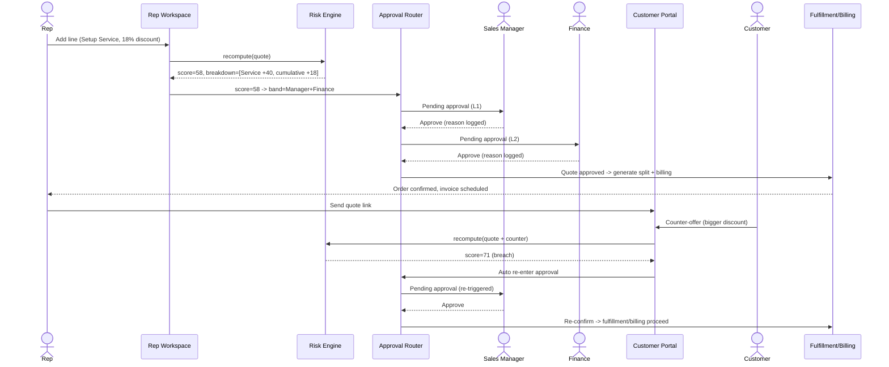
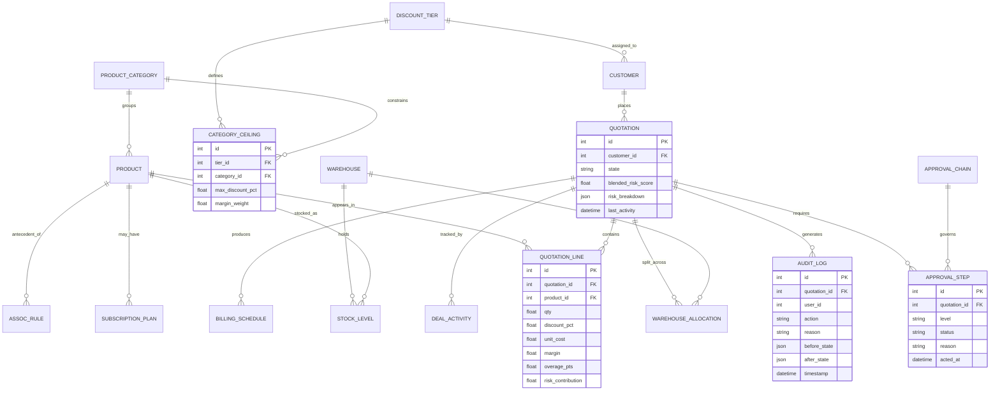
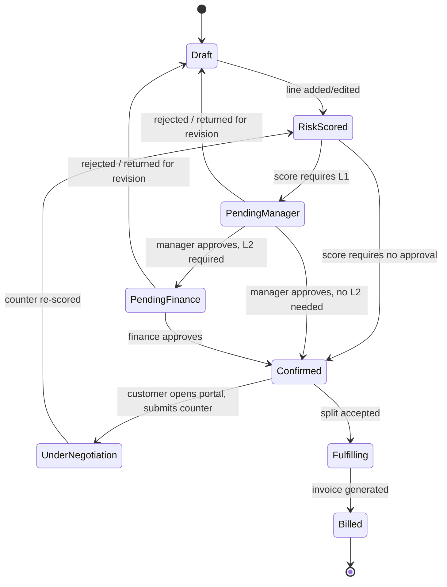

# DealFlow360 — Final Blueprint: The Glass-Box Deal Governance Engine

*A single-product, judge-defensible plan: what we build, exactly how, why it wins, and how we prove it live.*

---

## 1. Executive Summary

We build **one** product with **one** unmistakable identity: a **transparent, per-category, cumulative Discount Risk Engine ("BDRE")**, wrapped in a **real, separate customer negotiation portal** that feeds straight back into that engine. Every other required capability (multi-warehouse split, hybrid billing, upsell panel, deal-health dashboard) is shipped to a genuine, working MVP standard — but the BDRE and the portal round-trip are where 60% of engineering time and 100% of demo rehearsal goes, because that is the exact place the problem statement over-specifies and where nearly every other team will fake it with a single `if discount > 15%` check.

**Why this and not "all seven features equally":** with ~1,000 teams building the same brief, feature parity is worthless — everyone will have a quotation builder and *some* approval flow. What is scarce is **correct, explainable, cumulative business logic**, and a demo that *proves* it live instead of describing it. That is our entire strategy in one sentence.

**Verified reframing:** the Odoo India Hackathon is technology-agnostic ("all programming languages, frameworks, and database architectures are welcome") and judged on problem understanding, innovation, technical implementation, UI/UX, and team collaboration — not on Odoo-addon purity. So we build a clean custom full-stack application that mirrors Odoo's proven data model but is not shackled to its ORM, giving us velocity and total UI control under a hard deadline.

---

## 2. Problem & Root Cause

**Stated problem.** Simple sales tools handle quote → order → invoice well. Real B2B sales is messier: multi-level discount approvals, stock spread across warehouses, subscriptions mixed with one-time hardware, portal negotiation instead of email, and managers who discover a stalled deal only after it has died.

**Root problem.** Reps optimize *locally* (line by line); risk exists *globally and cumulatively* (across the order, and across a rep's pattern over time). No mechanism reconciles the two in real time. A rep can stay under every individual line's limit yet quietly give away serious order-level margin; or one thin-margin line can blow its own ceiling while the order's *average* discount still looks fine. Every existing tool we could verify checks **one number against one limit**. None reasons about **many small violations against different per-category ceilings, summed** — which is the exact two-part mechanic the problem statement spells out in unusual depth.

**User pain, by role:**
| Role | Pain today |
|---|---|
| Sales Rep | No real-time signal on whether a discount combo will trigger review; deals stall in queues the rep never saw coming |
| Sales Manager | Manually reviews quotes that don't need it, while quotes that *should* be flagged (many small overages) slip through undetected |
| Finance/Ops | Sees risk only after the order is confirmed; reconciling one-time + recurring billing on one order is manual and error-prone |
| Customer | Forced into slow email negotiation with no live status or way to counter-propose directly |
| Everyone | Deals go quiet and nobody notices until momentum is gone |

This is not a hypothetical pain: per *The Jolt Effect* (Dixon & McKenna, analysis of 2.5M recorded B2B sales conversations, reported in Harvard Business Review, 2022), **40–60% of qualified B2B deals end in "no decision"** rather than a competitor win. Forrester's *State of Business Buying 2024* found **86% of B2B purchases stall** during the buying process and **81% of buyers are dissatisfied** with the vendor they ultimately chose. A platform that both protects margin *and* keeps deals moving attacks both halves of this loss.

**Existing solutions → gap → opportunity** are detailed fully in Section 4; in one line: every commercial CPQ tool and every Odoo/OCA module we verified is a **threshold-or-Boolean** engine — nobody computes a **cumulative, per-category-weighted** risk score. That gap is exactly what we build.

---

## 3. Users & Workflow

**Roles:** Sales Rep (builds quotes) · Sales Manager (L1 approval, configures tiers, watches deal health) · Finance/Ops (L2 approval, warehouse splits, billing reconciliation) · Customer/Portal User (views, negotiates, confirms — separate restricted surface) · Admin (backend configuration, platform analytics).

**End-to-end path:** signup/login → admin configures products/tiers/warehouses/subscription plans → rep builds a quote → BDRE scores every edit live → auto-routes to Manager, then Finance if required → warehouse split proposed → hybrid billing schedule generated → customer negotiates in the portal → any threshold breach automatically re-opens approval → confirmed order proceeds to fulfillment and billing → manager watches the deal-health dashboard throughout → reports reviewed by period/team/status/product.



---

## 4. Competitive Landscape & Gap

| Tool | How discount governance actually works (verified) | Limitation vs. our approach |
|---|---|---|
| Salesforce CPQ | Rule-by-rule, Boolean AND/OR conditions on fields vs. fixed thresholds; nearest aggregation is an "Approval Variable" computing avg/max discount across lines (Salesforce Trailhead) | One aggregate vs. one limit — can't catch many lines each a little over *their own differing* category ceilings |
| DealHub | "Standard approval workflows rely on discount percentage thresholds — not specific price points" (DealHub Community) | Single-threshold, not cumulative or category-aware |
| Conga CPQ | Boolean entry-criteria rules, AND/OR combined (Conga docs) | Same threshold/Boolean limitation |
| PandaDoc | Per-line, per-section, and "total discount" (sum across quote) conditions vs. thresholds (PandaDoc Help Center) | Sum-of-discounts is closer, but still a single number vs. a single limit — no per-category ceiling logic |
| HubSpot | Predefined single approver, threshold-based workflow routing (HubSpot Community; Quotivity) | Simplest of the group; no multi-level or blended logic |
| Odoo marketplace (`sales_approval_enhancement`, `l4l_sale_discount_approval`) | Blocks confirmation if **any single line** exceeds one configured percentage | No categories, no cumulative pattern, no blended score |
| OCA `base_tier_validation` | Configurable multi-tier, sequenced approvals, reusable on any model, triggered by a Python domain condition (PyPI/OCA) | Closest open-source art — but the trigger is still a single condition, not a computed cross-category cumulative score |

**Adjacent categories, verified:** Odoo's Optional/Accessory/Alternative Products are manually configured per product (Odoo docs) — not learned from co-purchase history. Odoo Subscriptions proration runs through the upsell wizard / `prepare_upsell_order()` path and commonly requires a Service-type product (Octura Solutions; oduist.com). Odoo's multi-warehouse delivery split "mandate[s] manual intervention" per real-world users (Odoo Forum). Gong/Clari define commercial deal-health scoring but cost **~$1,300–1,600/user/year plus a $5,000–50,000/year platform fee** (2026 buyer-data teardowns) and are separate systems bolted onto a CRM, not integrated into the quoting flow itself.

**The gap, stated once:** nobody computes a **cumulative, per-category-weighted** discount risk score, and nobody re-runs that score automatically when a customer counters inside a real negotiation portal. That is the entire opportunity.

---

## 5. Winning Product — What Exactly We Are Building

**DealFlow360** is a sales-operations web application with three surfaces sharing one backend:

1. **Rep Workspace** (internal, authenticated) — quotation builder, live risk/margin panel, upsell panel, fulfillment screen, billing screen, deal-health dashboard.
2. **Approver Console** (internal, role-gated) — approval queue, blended-score breakdown, approve/reject/return-for-revision, audit trail.
3. **Customer Portal** (external, separately authenticated via magic link) — read the quote, comment line-by-line, submit a counter-discount, confirm with one click. This is a genuinely distinct application surface — different auth, different permitted actions, different UI — not the internal screen with a label swapped.

All three surfaces call the same backend service layer, and every state-changing action passes through the **Blended Discount Risk Engine** before it is allowed to change the quotation's state. That single design decision — *nothing bypasses the engine* — is what makes the "self-governing" claim in the brief literally true rather than a marketing phrase.

---

## 6. Core Innovation — The Blended Discount Risk Engine (BDRE)

### 6.1 What it computes
Two mechanics, both required by the brief, both usually missed:

**(a) Per-line ceiling breach.** Every line is checked against *its own category's* ceiling for *this customer's tier* — not one order-wide number.

**(b) Cumulative aggregate pattern.** Every line's overage (however small) is weighted by its margin sensitivity and its share of order value, then summed. A quote where four lines are each only 2–3 points over their own ceilings — none alarming alone — still escalates once the *sum* crosses a threshold.

### 6.2 The formula
```
overage_i        = max(0, discount_i − ceiling(category_i, tier))
line_risk_i       = overage_i × margin_weight_i × (line_value_i / order_value)
blended_score     = Σ line_risk_i   over all lines i
hard_flag         = TRUE if any overage_i > single_line_escalation_cap
routing_band      = lookup(blended_score, hard_flag) → {None, Manager, Manager+Finance}
```
`margin_weight_i` is higher for thin-margin categories (e.g., Services) than for healthy-margin categories (e.g., Hardware) — configured by admin, not hardcoded — so the *same* percentage overage on a low-margin line contributes more risk than on a high-margin line.

### 6.3 Worked example (used in the demo)
Gold tier, ceilings: Hardware 15%, Services 10%.

| Line | Discount given | Ceiling | Overage | Contribution |
|---|---|---|---|---|
| Laptop (Hardware) | 12% | 15% | 0 | 0 |
| Setup Service | 18% | 10% | 8 pts | large (single-line hard flag) |
| Cable Kit (Hardware) | 17% | 15% | 2 pts | small |
| Install Labor (Service) | 13% | 10% | 3 pts | small |
| Warranty Extension | 12% | 10% | 2 pts | small |

Even though the **order-average** discount looks acceptable, (1) the Service line alone breaches its own ceiling by 8 points and hard-flags the quote, and (2) three *other* lines each only 2–3 points over their ceilings sum to a material cumulative contribution that would independently justify escalation. **Both signals fire — this is the moment the demo proves the point no competitor tool can.**

### 6.4 Why this is deterministic, not ML
Governance requires explainability and auditability. A learned model here would be a liability, not a feature — we say this explicitly to judges as a sign of engineering judgment, not a missing capability.

---

## 7. Killer Features (each justified: value + advantage + feasibility)

1. **Blended Discount Risk Engine** — stops both single-line abuse and death-by-a-thousand-small-overages; out-implements every verified CPQ competitor; pure application logic, demos in 20 seconds.
2. **Real negotiation portal wired to the BDRE** — customer counters, engine re-scores, quote auto-re-enters approval on screen; no competitor tool re-runs governance on a customer counter-offer.
3. **Shipment-minimizing warehouse split** — a genuine greedy allocation algorithm (Section 10.3) beats Odoo's manual-intervention reality.
4. **Co-purchase upsell panel** — Apriori-derived, margin-aware suggestions beat Odoo's manually curated Optional/Accessory products.
5. **Rep-relative deal-health & anomaly dashboard** — z-score against the *rep's own* baseline plus stall detection, Gong/Clari-style value at zero incremental cost, fully integrated into the quoting flow instead of bolted onto a CRM.

---

## 8. AI Strategy — Exactly Two Models, Each Earning Its Place

### 8.1 Upsell ranking — Apriori association-rule mining
```
INPUT: historical order lines (seed data), min_support, min_confidence, min_margin
1. Build transactions = one set of product_ids per historical order
2. Run Apriori to find frequent itemsets ≥ min_support
3. Generate rules {A} → {B} with confidence ≥ min_confidence
4. Score rules by LIFT = confidence({A}→{B}) / support({B})
5. Filter out any {B} with margin < min_margin_threshold
6. Persist top rules to assoc_rule table (offline / nightly job)

AT QUOTE-BUILD TIME:
  current_items = products already in the quote
  candidates = assoc_rule WHERE antecedent ⊆ current_items
  rank candidates by lift DESC
  return top-N with margin_delta and promo_tag
```
This is instant at runtime because scoring happens against precomputed rules — no live model inference — which matters for a live demo where latency = risk.

### 8.2 Discount & deal anomaly detection — z-score
```
FOR a given rep:
  μ = mean(rep's historical discount % across past N quotes)
  σ = stdev(same population)
  z = (current_discount − μ) / σ
  IF |z| > 3: flag as anomalous ("this discount is unusual for THIS rep")

FOR deal staleness:
  stall_days = today − last_activity_date
  IF stall_days > configured_threshold: flag as stalled
```
Rep-relative (not team-wide) thresholds matter: a rep who normally discounts aggressively should not be flagged for their normal behavior, and a conservative rep's first large discount should be. We note the more robust **modified z-score (MAD-based)** as the production-grade upgrade for small/non-Gaussian samples, and implement standard z-score for the hackathon given seed-data volume.

### 8.3 What we deliberately do NOT add
No chatbot, no LLM agent, no blockchain, no generic "AI dashboard." Each would add surface area without solving a stated problem — and an unjustified AI feature is a bigger red flag to a technical judge than no AI at all.

---

## 9. Odoo-Native Strategy

The hackathon is verified technology-agnostic, so our Odoo alignment is deliberate positioning, not compliance:

- **We mirror Odoo's data model** (product templates + variants, pricelist rules scoped by category/tier, `sale.order` / `sale.order.line`, subscription recurring plans, warehouse/stock routes) because it is a battle-tested schema, not because we are required to use Odoo.
- **We name our exact edge over native Odoo and the OCA ecosystem**, feature by feature: manual Optional Products vs. our learned upsells; Service-only proration vs. our general daily-proration engine; manual warehouse-split intervention vs. our shipment-minimizing optimizer; single-threshold marketplace modules and `base_tier_validation`'s single-condition trigger vs. our cumulative, per-category blended score.
- **If asked "why not build inside Odoo,"** the honest, prepared answer: `base_tier_validation` + custom computed fields on `sale.order` is the credible Odoo-native path, and we chose an independent stack purely for velocity, full UI control of the negotiation portal, and demo reliability under a hard deadline — not because it was infeasible in Odoo.

---

## 10. Technical Architecture

### 10.1 System diagram
```mermaid
flowchart TD
    subgraph Client
      RepUI[Rep Workspace SPA]
      PortalUI[Customer Negotiation Portal]
      AdminUI[Admin and Config]
      DashUI[Manager Deal-Health Dashboard]
    end
    subgraph API[Application Server]
      Auth[Auth: internal login + portal magic-link]
      BDRE[[Blended Discount Risk Engine]]
      Route[Approval Router]
      Split[Warehouse Split Optimizer]
      Bill[Hybrid Billing and Proration]
      Reco[Upsell Engine - Apriori]
      Health[Deal-Health and Anomaly - z-score]
      Audit[Audit Log Service]
    end
    subgraph Data[(PostgreSQL)]
      Prod[(products / variants / pricelists)]
      Quote[(quotations / lines)]
      Tier[(discount tiers / category ceilings / chains)]
      WH[(warehouses / stock)]
      Subs[(subscription plans / schedules)]
      Rules[(assoc_rules)]
      Log[(audit_log / activity)]
    end
    RepUI --> Auth --> API
    PortalUI --> Auth
    RepUI --> BDRE
    PortalUI -->|counter-offer| BDRE
    BDRE --> Route --> Audit
    BDRE --> Tier
    Route --> Quote
    RepUI --> Reco --> Rules
    Quote --> Split --> WH
    Quote --> Bill --> Subs
    DashUI --> Health --> Log
    API --> Data
    Audit --> Log
```

### 10.2 Data model (entity-relationship)


### 10.3 Warehouse-split algorithm (greedy, shipment-minimizing)
```
INPUT: order lines with required quantities, stock_level per warehouse, shipping_weight per warehouse
1. Sort warehouses by shipping_weight ascending (cheapest/preferred first)
2. FOR each line (largest quantity first):
     remaining = line.qty
     FOR each warehouse in sorted order:
        available = stock_level(warehouse, line.product)
        take = min(remaining, available)
        IF take > 0: allocate(warehouse, line.product, take); remaining -= take
        IF remaining == 0: break
     IF remaining > 0: mark as backorder(line.product, remaining)
3. Compute shipment_count = number of distinct warehouses used across all lines
4. Return allocation plan + shipment_count + estimated cost
5. WHEN backordered stock arrives: trigger "Consolidate Remaining Backorder" prompt
```
This is a bounded, explainable heuristic — not a full bin-packing solver — appropriate for hackathon time constraints and fully overridable by the rep (Manual Override button), so the demo can never dead-end on an edge case.

### 10.4 Proration formula (hybrid billing)
```
days_remaining_in_cycle = billing_cycle_end − change_date
proration_factor        = days_remaining_in_cycle / total_days_in_cycle
prorated_amount         = (new_price − old_price) × qty × proration_factor
-> generates a credit_note or additional invoice line depending on sign
```

### 10.5 Quotation lifecycle (state machine)


---

## 11. File & Project Structure

A single-repo, single-language-per-tier layout keeps the "business logic lives in real application code" requirement obvious to a judge skimming the repo in 60 seconds.

```
dealflow360/
├── README.md                     # setup, demo script, architecture summary
├── ARCHITECTURE.md                # one-page diagram + data model (deliverable requirement)
├── docker-compose.yml              # one-command local spin-up for judges
├── seed/
│   ├── seed_products.sql          # categories, products, variants
│   ├── seed_tiers.sql             # Bronze/Silver/Gold + category ceilings
│   ├── seed_orders_history.sql    # historical co-purchase data for Apriori
│   └── seed_warehouses.sql        # warehouses + stock levels
│
├── backend/
│   ├── manage.py / main.py
│   ├── config/
│   │   └── settings.py
│   ├── core/
│   │   ├── models/
│   │   │   ├── product.py
│   │   │   ├── quotation.py
│   │   │   ├── discount_tier.py
│   │   │   ├── warehouse.py
│   │   │   ├── subscription.py
│   │   │   └── audit_log.py
│   │   ├── services/
│   │   │   ├── bdre.py                 # ★ Blended Discount Risk Engine — core IP
│   │   │   ├── approval_router.py      # routes score → approval bands
│   │   │   ├── warehouse_split.py      # greedy allocation algorithm
│   │   │   ├── billing_proration.py    # hybrid billing + proration math
│   │   │   ├── upsell_engine.py        # Apriori rule generation + lookup
│   │   │   ├── deal_health.py          # z-score anomaly + stall detection
│   │   │   └── audit.py                # append-only logging
│   │   └── tests/
│   │       ├── test_bdre.py            # ★ worked-example unit tests (Section 6.3)
│   │       ├── test_warehouse_split.py
│   │       ├── test_proration.py
│   │       └── test_upsell_engine.py
│   ├── api/
│   │   ├── routes_internal.py          # rep + manager + finance + admin endpoints
│   │   └── routes_portal.py            # customer portal endpoints (separate auth scope)
│   └── jobs/
│       └── nightly_apriori_rebuild.py  # offline association-rule refresh
│
├── frontend-internal/                  # Rep Workspace + Approver Console + Admin
│   ├── src/
│   │   ├── pages/
│   │   │   ├── QuotationBuilder.tsx
│   │   │   ├── RiskBreakdownPanel.tsx  # ★ explainable score UI
│   │   │   ├── ApprovalQueue.tsx
│   │   │   ├── WarehouseSplitScreen.tsx
│   │   │   ├── BillingScreen.tsx
│   │   │   ├── UpsellPanel.tsx
│   │   │   ├── DealHealthDashboard.tsx
│   │   │   └── AdminConfig.tsx
│   │   └── components/
│   │
│   └── frontend-portal/                # Customer Negotiation Portal — separate app
│       ├── src/
│       │   ├── pages/
│       │   │   ├── QuoteView.tsx
│       │   │   ├── CounterOfferForm.tsx
│       │   │   └── ConfirmationScreen.tsx
│       │   └── auth/
│       │       └── magicLink.ts
│
└── docs/
    ├── judge_qna.md                    # Section 14/15 pre-written answers
    └── demo_script.md                  # Section 13 timed script
```

**Why this structure wins a code-review glance:** `core/services/bdre.py` is a named, isolated file — a judge who opens the repo sees immediately that the risk engine is real code with its own unit tests (`test_bdre.py` literally encodes the Section 6.3 worked example as an assertion), not a hidden `if` statement inside a controller. The portal living in its own frontend package with its own auth module physically proves the "real, separate, restricted view" requirement before anyone even runs the app.

---

## 12. How We Will Build It — Timeline

```mermaid
gantt
    title Hackathon Build Plan (illustrative, compress/expand to actual time budget)
    dateFormat  X
    axisFormat %s
    section P0 - Must Win
    Data model + seed data           :p0a, 0, 3
    BDRE core + unit tests           :p0b, after p0a, 4
    Approval router + audit log      :p0c, after p0b, 2
    Rep workspace: builder + risk UI :p0d, after p0b, 4
    Customer portal + counter-offer  :p0e, after p0c, 4
    Hybrid billing + proration       :p0f, after p0a, 3
    section P1 - Should Have
    Warehouse split algorithm + UI   :p1a, after p0f, 3
    Deal-health dashboard (z-score)  :p1b, after p0e, 2
    Upsell panel (seeded rules)      :p1c, after p0d, 2
    section P2 - Nice to Have
    Apriori live rebuild job         :p2a, after p1c, 2
    PDF/XLS export, multi-currency   :p2b, after p1a, 2
    section Final
    Demo rehearsal + seed reset      :fin, after p2a, 2
```



**Team split (4-person team assumption):** one owns `bdre.py` + approval router + tests (the core IP, protected from scope creep); one owns the rep workspace UI + risk-breakdown panel; one owns the customer portal end-to-end (auth, counter-offer, re-score trigger); one owns warehouse split + billing + deal-health + seed data. Everyone rehearses the demo script together in the last block — nobody touches P0 code during rehearsal.

---

## 13. Demo Flow & WOW Moment (5 minutes, two full flows)

1. **0:00–0:30** — Admin view: Gold tier, Hardware 15% / Services 10% ceilings, approval bands, all visibly configurable (not hardcoded).
2. **0:30–1:30 — WOW #1.** Build the quote from Section 6.3 live. Laptop at 12% (fine). Add Setup Service at 18% — risk panel animates: *"Service line 8 pts over ceiling → hard flag → Manager + Finance."* Add three more lines each 2–3 points over — the cumulative meter crosses its own band *independently*. Narrate explicitly: "No single line here looks alarming by itself — that's the point."
3. **1:30–2:15** — Accept an upsell suggestion; margin updates live; point out it's ranked by lift from co-purchase history, not a static list.
4. **2:15–3:00** — Show auto-routing fire with zero manual "request approval" click; Manager approves, Finance approves; open the audit trail to show user/timestamp/reason on every action.
5. **3:00–3:40** — Confirm; show the warehouse split across two warehouses with shipment count and cost; trigger a backorder consolidate prompt.
6. **3:40–4:30 — WOW #2.** Switch browsers/URLs to the customer portal (different login). As the customer, submit a bigger discount counter. On screen, the score re-computes and the quote **automatically re-enters approval** — no rep action required. Confirm with one click.
7. **4:30–5:00** — Hybrid invoice: one-time line invoiced now, subscription schedule shown separately; record payment, watch invoice status flip to Paid; glance at the deal-health dashboard flagging a stalled/anomalous deal elsewhere in the pipeline.

---

## 14. Judge Objections & Deep Answers ("explain everything")

**"Walk me through the exact math of the risk score."** → Present the Section 6.2 formula and the Section 6.3 worked table live; show `test_bdre.py` asserting that exact table's output — the judge can read the test and the code side by side.

**"What happens on a tie, or if two categories conflict?"** → The routing band is looked up from `blended_score` and a separate `hard_flag`; if the hard flag is true regardless of the aggregate score, the higher band always wins — deterministic, no ambiguity, tested.

**"Is this just a fancy if-statement?"** → No — show that ceilings, weights, and bands are all rows in the `category_ceiling` / `approval_chain` tables, editable by an admin with zero code changes. That is the difference between a rule and an engine.

**"Why Apriori and not a neural recommender?"** → At hackathon-scale seed data, a learned embedding model would overfit or need training data we don't have; Apriori's support/confidence/lift are directly interpretable, computed offline, and looked up in O(1) at demo time — the right-sized tool, and we can defend every ranked suggestion's lift value on request.

**"Why z-score and not a fancier anomaly model?"** → Same reasoning: explainable, cheap, correct at this data scale; we can name the upgrade path (modified z-score / MAD for robustness) unprompted, which shows we know the limitation rather than being caught by it.

**"How does the warehouse split scale to hundreds of SKUs?"** → It's a greedy heuristic bounded by `O(lines × warehouses)`; not globally optimal, but correct and fast, with a manual-override escape hatch — appropriate engineering trade-off for the problem size described, and we say so rather than overclaiming optimality.

**"Prove the portal isn't just a relabeled internal page."** → Different frontend package (`frontend-portal/`), different auth flow (magic link vs. password), different permitted actions (comment/counter/confirm only — no discount override, no product catalog access), and the one action a purely cosmetic clone couldn't fake: submitting a counter-offer actually calls the same `bdre.py` used internally and can flip the quotation's state on screen.

**"What's your test coverage / how do you know this is correct, not just demo-scripted?"** → Unit tests on the BDRE encode the worked numeric example as an assertion (not just a demo click-through); warehouse split and proration have their own test files; this is called out explicitly because the brief warns against faking business rules for the demo.

**"Why not build this inside Odoo itself?"** → Answered fully and honestly in Section 9 — we know the Odoo-native path (`base_tier_validation` + computed fields) and chose independence for velocity and demo control, not because we couldn't do it in Odoo.

**"What would you build next with more time?"** (required deliverable) → Modified z-score/MAD for anomaly robustness; a live-refreshed Apriori job (currently offline/nightly for demo stability); a real bin-packing/optimization solver for warehouse splits at larger SKU counts; multi-currency and multi-company support (explicitly a bonus in the brief); a notification layer (email/SMS) for approval and negotiation events.

---

## 15. Risks & Mitigations

| Risk | Mitigation |
|---|---|
| Over-scoping across all 7 feature areas | Strict P0/P1/P2 discipline (Section 12); BDRE + portal are non-negotiable, everything else is sacrificable |
| Warehouse optimizer edge cases eat time | Bounded greedy heuristic + always-available manual override |
| Apriori under-delivers on thin seed data | Ship curated seeded rules; present Apriori as the generation method with lift/confidence visible |
| Proration correctness under time pressure | Simple daily-proration formula, visible and testable, over generality |
| Demo fragility / live-coding risk | Deterministic seed data, rehearsed exact script, P2 features kept off the critical demo path |
| Judges expect an Odoo-native build | Pre-empt with the verified "any stack allowed" framing plus the explicit Odoo-equivalent-path answer in Section 9/14 |

---

## 16. Competitive Scorecard

| Capability | DealFlow360 (us) | Likely generic team | Salesforce CPQ / DealHub / Conga | Odoo native + OCA |
|---|---|---|---|---|
| Discount approval | Per-category + cumulative blended score, explainable, configurable | Single `if discount>X%` | Threshold/Boolean; avg/max variable at best | Single-threshold modules; `base_tier_validation` = single-condition trigger |
| Explainable routing | Line-by-line breakdown + audit | Opaque flag | Rule audit, not cumulative rationale | Basic state + approver |
| Negotiation portal | Real, restricted, re-scores counter-offers | Relabeled internal screen | Text redlining, no re-scoring | Online sign/pay only, no counter |
| Upsell | Apriori co-purchase + live margin | Static list | Some AI (enterprise tier) | Manual optional products |
| Warehouse split | Shipment-minimizing + consolidate prompt | Manual pick | N/A (CPQ scope) | Manual intervention |
| Hybrid billing | One-time + recurring, prorated, one order | Often skipped | Add-on/CLM | Yes (Service-type caveat) |
| Deal health | Rep-relative z-score + stall + nudge | Absent | Gong/Clari (separate, ~$1.3–1.6k/user/yr + platform fee) | Absent |

---

## 17. Why We Can Win

The brief telegraphs its own rubric: it spends more words on the Blended Discount Risk Score than any other feature, and separately insists the negotiation portal be real and business rules not be faked. Most of 1,000 teams will ship a competent quote-to-cash CRUD app with a single-threshold approval and a static upsell list. We win by turning the exact feature judges will probe hardest into transparent, tested, configurable IP; wiring the one integration (portal → re-score → re-approve) nobody else will build end to end; and proving both live, with code and tests a judge can actually inspect — not just a demo script.

## 18. Final Bet

Build the **Blended Discount Risk Engine** as a transparent, per-category, cumulative "glass-box" governance engine — real application code, data-driven configuration, full audit trail, unit-tested against the worked example — and wire it to a genuinely separate customer negotiation portal that re-scores counter-offers and auto-re-enters approval on screen. Ship the other five feature areas to honest, working MVP, but put your polish and your rehearsal time here. Demo exactly two flows: the multi-line cumulative-overage quote, and the customer-portal counter-offer that bounces the deal back into approval live. That is the one thing to build, it is the thing no other team and no commercial CPQ tool (verified: Salesforce CPQ, DealHub, Conga are all threshold/Boolean) does well, and it is the thing that will make the judges remember you.

---

### Source & Confidence Notes
**Verified (primary/vendor sources):** Odoo hackathon is technology-agnostic (hackathon.odoo.com; Indus/NMIT FAQ pages); Odoo Optional/Accessory/Alternative products are manually configured (Odoo docs); Odoo Subscriptions proration via upsell wizard / Service-product dependency (Odoo docs; Octura Solutions; oduist.com); Odoo online Sign & Pay portal confirmation (Odoo docs); Odoo multi-warehouse split needs manual intervention (Odoo Forum); marketplace discount-approval modules are single-threshold (Odoo Apps Store listings); OCA `base_tier_validation` capabilities (PyPI/OCA); Salesforce CPQ Advanced Approvals rule-by-rule/threshold with avg/max variables (Salesforce Trailhead); DealHub "thresholds—not specific price points" (DealHub Community); Conga Boolean entry criteria (Conga docs); PandaDoc per-line/section/total-discount conditions (PandaDoc Help Center); Gong pricing structure (2026 buyer-data teardowns); 40–60% no-decision stat (*The Jolt Effect*/HBR 2022); 86% stall/81% dissatisfaction (Forrester 2024); Apriori and z-score/MAD techniques (ResearchGate; Tinybird; GeeksforGeeks; arXiv 2103.12323).

**Reasoned assumptions (labeled as such):** that judges will specifically probe whether the blended score is real vs. faked (inferred from the brief's disproportionate detail, not a stated rubric line); the file structure, algorithms, timeline, and team split are our engineering design, not hackathon requirements; the "~1,000 teams" figure is the user's premise, not independently verified.

**Could not verify:** published Odoo hackathon judging weightings specific to this exact problem statement; past-winner patterns for this event series.
